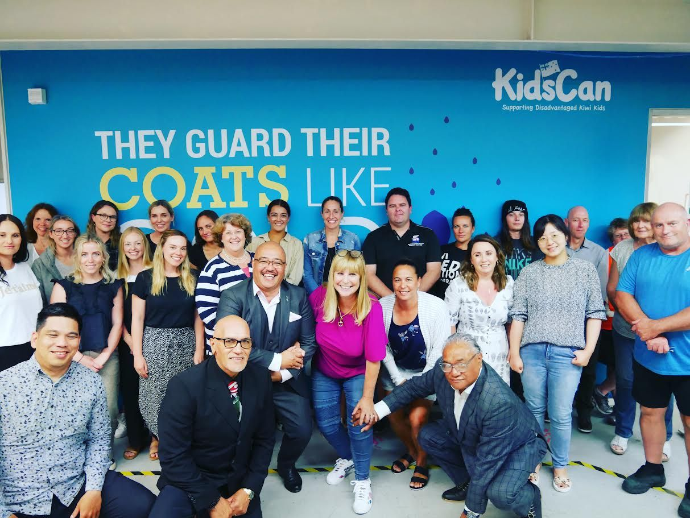

# About Page - Image Asset Guide

This document outlines the image requirements for the About Us page at `pages/about.html`.

## Required Images

### 1. Breviss Wolfgramm Profile Photo
- **Path**: `assets/images/pages/about/breviss-wolfgramm.jpg`
- **Purpose**: Founder profile image for the Founder Profile Section
- **Recommended Dimensions**: 800x1000px (portrait)
- **Description**: Professional portrait of Breviss Wolfgramm
- **Format**: JPG or WebP
- **Alt Text**: "Breviss Wolfgramm"

### 2. Approach/Team Photo
- **Path**: `assets/images/pages/about/approach-team.jpg`
- **Purpose**: Team collaboration image for the Approach Section
- **Recommended Dimensions**: 1200x800px (landscape)
- **Description**: Image showing team members or cultural engagement activities
- **Format**: JPG or WebP
- **Alt Text**: "Wolfgramm Holdings team approach"
- **Reference**: Use the group photo from screenshot 5 showing people gathered together

## Where Images Are Used

### Founder Section
```html
<div class="founder-image">
    
</div>
```

This appears in the middle of the page alongside the founder's bio and description.

### Approach Section
```html
<div class="approach-image">
    
</div>
```

This appears near the bottom of the page in the "Relational First. Outcomes Second." section.

## Temporary Placeholders

Until you have the actual images, you can:

1. **Create placeholder images** with the correct dimensions
2. **Use temporary stock photos** from sites like Unsplash or Pexels
3. **Reuse existing images** from the home folder as temporary solutions:
   - Use `../home/team-3.jpg` temporarily for `approach-team.jpg`

## Image Optimization Tips

- **Compress images** before uploading (aim for under 200KB per image)
- **Use WebP format** for better performance when possible
- **Provide fallback JPG** for older browsers
- **Include descriptive alt text** for accessibility
- **Ensure high resolution** for Retina displays (2x dimensions)

## Current Status

❌ `breviss-wolfgramm.jpg` - **MISSING** (Required for founder section)
❌ `approach-team.jpg` - **MISSING** (Required for approach section)

## Quick Fix

To temporarily fix broken images, you can:

1. Copy an existing team photo:
```bash
copy "assets\images\pages\home\team-3.jpg" "assets\images\pages\about\breviss-wolfgramm.jpg"
copy "assets\images\pages\home\team-3.jpg" "assets\images\pages\about\approach-team.jpg"
```

2. Or download placeholder images from:
   - https://placeholder.com/
   - https://via.placeholder.com/

## Image Sources from Original Site

Based on the screenshots provided:
- Screenshot 2 shows Breviss Wolfgramm's profile photo (need to extract/recreate)
- Screenshot 5 shows a team photo that can be used for the approach section

## Next Steps

1. ✅ Create the `about` folder structure
2. ⏳ Source/create the Breviss Wolfgramm portrait
3. ⏳ Source/create the team approach photo
4. ⏳ Optimize images for web performance
5. ⏳ Test the page with all images in place

